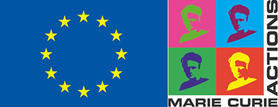

 

## Program

**1.00-1.15** [Federica Giardina:](https://www.linkedin.com/in/federica-giardina-876785133/) Introduction to the SchiSTOP project

**1:15-1:30** [Veronica Malizia:](https://www.linkedin.com/in/veronica-malizia/) Individual based modelling for schistosomiasis: the importance of regulating mechanisms

**1:30-2:00** Panel discussion:

* The role of the intermediate host: interpreting malacological surveys

* Mechanisms of immunity: triggers, protection and decay

* Disentangling exposure from immunity: informing the model using water contact data

* Which additional data can be used to better inform our models?

**2:00-2:15** Break

**2:15-2:30** [Veronica Malizia:](https://www.linkedin.com/in/veronica-malizia/) Implications of different regulating mechanisms on schistosomiasis dynamics and interventions 

**2:30-2:55** Panel discussion: model extensions and research gaps (modelling, science and policy)

**2:55-3:00** Final remarks

## Location

The meeting will be hosted on [Teams.](https://teams.microsoft.com/l/meetup-join/19%3ameeting_YTAzOTlmZmItNTk3Mi00ZmFlLWE0ZTUtMjNjNjFjNDNlZjA0%40thread.v2/0?context=%7b%22Tid%22%3a%22b208fe69-471e-48c4-8d87-025e9b9a157f%22%2c%22Oid%22%3a%2247de82fd-889e-412b-95c5-2db5008d5935%22%7d)

## Contact Details

**Email:** federica.giardina@radboudumc.nl 

## Funding
{width=50%}

This SchiSTOP project has received funding from the European Union’s Horizon 2020 research and innovation programme under the Marie Sklodowska-Curie grant agreement No 846873. For more information, please visit the European Commission's Community Research and Development Information Service (CORDIS) (https://cordis.europa.eu/project/id/846873).
